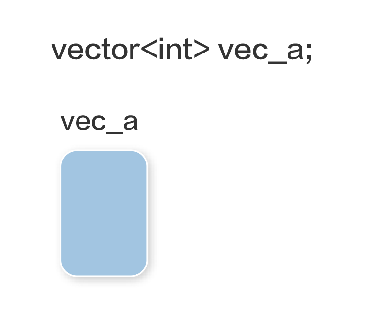
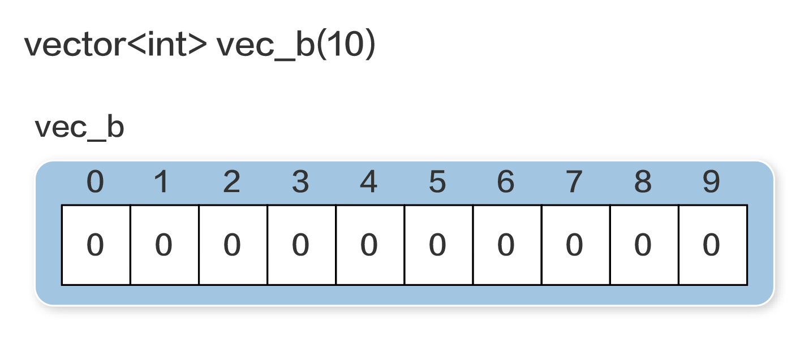
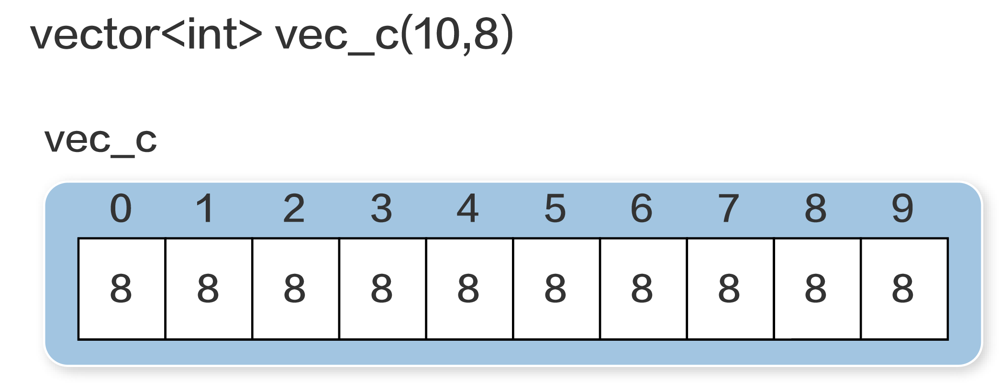
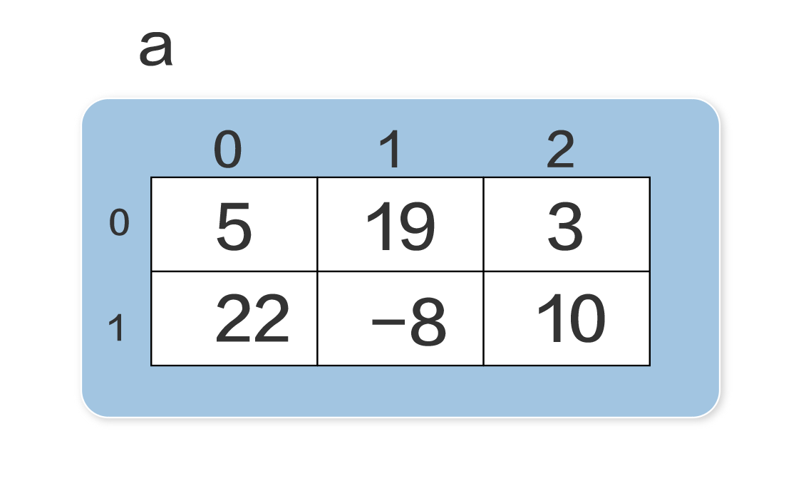

# 11 Vectors
- vector可以儲存多個值
- 必需是相同資料類型
- 使用索引

## 11_1 建立和使用Vectors

### 1. 使用前2種匯入方式

```c++
#include <vector>
```

```c++
using namespace std;
```

### 2. 4種建立vector的方法

#### 建立空的vec_a

```c++
vector<int> vec_a;
```



#### 建立特定長度的vector

- 建立長度10,預設每個元素值為0

```c++
vector<int> vec_b(10)
```



#### 指定預設元素值

- 建立長度為10,預設值為8

```c++
vector<int> vec_c(10,8)
```



#### 直接給值
- 注意是{}(大括號)

```c++
vector<int> vec_d{10, 20, 30, 40, 50}
```

### vetcor支援c++11以後版本

### 使用vector

```c++
#include <iostream>
#include <vector>
using namespace std;

int main() {
	vector<int> list(3);
	list[0]=5;
	list[1]=-3;
	list[2]=12;
	cout << list[1] << endl;
}
```

### vectors 支援所有c++的data type

```c++
vector<int> list;
vector<double> collection{ 1.0, 3.5, 0.5, 7.2 };
vector<char> letters{ 'a', 'b', 'c' };
```

### vectors []內所支援的語法
- 數值:a[34]
- 數值變數:a[x]
- 數值運算:a[x+3]
- 數值function:a[max(x,y)]

### 讀取整個vectors

```c++
#include <iostream>
#include <vector>
using namespace std;

int main() {
	double sum = 0.0;
	const int NUMBER_OF_ENTRIES = 5;
	vector<double> numbers(NUMBER_OF_ENTRIES);
	cout << "請輸入" << NUMBER_OF_ENTRIES << "個數值:";
	for(int i=0;i<NUMBER_OF_ENTRIES;i++){
		cin >> numbers[i];
		sum += numbers[i];
	}		
	cout << "此vector";
	for(int i=0;i<NUMBER_OF_ENTRIES-1;i++){
		cout << numbers[i] << ", ";
	}	
	cout << numbers[NUMBER_OF_ENTRIES-1] << "的平均是" << sum / NUMBER_OF_ENTRIES << endl;
}

-----------------------------------------

請輸入5個數值:5 6 7 8 9
此vector5, 6, 7, 8, 9的平均是7
```

### 使用for(區塊變數:vector) 語法

```c++
for(type 區塊變數:vector){
	statement
} 
```

```c++
#include <iostream>
#include <vector>
using namespace std;

int main() {
  vector<double> vec(10);
  cout << "請輸入10個數字:";
  for (double &elem : vec) {
    cin >> elem;
  }

  for (double elem : vec) {
    cout << elem << endl;
  }
}

===============================

請輸入10個數字:1 2 3 4 5 6 7 8 9 0
1
2
3
4
5
6
7
8
9
0
```


### vector 方法
- push_back
- pop_back
- operator[]
- at
- size
- empty
- clear

```c++
#include <iostream>
#include <vector>

using namespace std;

int main() {
	vector<int> list;
	list.push_back(5);
	list.push_back(-3);
	list.push_back(12);

	for(int i=0; i<list.size(); i++){
		cout << list.operator[](i) << endl;
	}
}

//=======================================
5
-3
12

```

```c++
#include <iostream>
#include <vector>

using namespace std;

int main() {
  vector<int> list;
  list.push_back(5);
  list.push_back(-3);
  list.push_back(12);
  list.pop_back();
  list.pop_back();

  for (int i = 0; i < list.size(); i++) {
    cout << list.operator[](i) << endl;
  }
}

//==============================
5
```

```c++
vec.operator[](2)
vec[2]
```

```c++
vec.empty()
vec.size() != 0
```

### vectors 當作參數

#### void print(vector<int> v){}
- call by value

```c++
#include <iostream>
#include <vector>

using namespace std;

void print(vector<int> v) {
  for (int elem : v) {
    cout << elem << " ";
  }
  cout << endl;
}

int sum(vector<int> v){
	int result = 0;
	for(int elem : v){
		result += elem;
	}
	return result;
}

int main() {
	vector<int> list{2, 4, 6, 8};
	print(list);
	cout << sum(list) << endl;
	int n = list.size();
	for(int i=0; i<n; i++){
		list[i] = 0;
	}

	print(list);
	cout << sum(list) << endl;
	
}

//=====================================
2 4 6 8 
20
0 0 0 0 
0
```

#### void print(const vector<int>& v){}
- const代表不可修改v的元素內容(read only)
- call by reference

```c++
#include <iostream>
#include <vector>

using namespace std;

void print(const vector<int>& v) {
  for (int elem : v) {
    cout << elem << " ";
  }
  cout << endl;
}

int sum(const vector<int>& v){
	int result = 0;
	for(int elem : v){
		result += elem;
	}
	return result;
}

int main() {
	vector<int> list{2, 4, 6, 8};
	print(list);
	cout << sum(list) << endl;
	int n = list.size();
	for(int i=0; i<n; i++){
		list[i] = 0;
	}

	print(list);
	cout << sum(list) << endl;
	
}

//==============================
2 4 6 8 
20
0 0 0 0 
0
```


```c++
//動態改變vector的內容

#include <iostream>
#include <vector>
#include <cstdlib>

using namespace std;

void print(const vector<int>& v) {
  for (int elem : v) {
    cout << elem << " ";
  }
  cout << endl;
}

void make_random(vector<int>& v, int size){
	v.clear();
	int n = rand() % size + 1;
	for(int i=0; i<n;i++){
		v.push_back(rand());
	}
}

int main() {
	srand(2);
	vector<int> list;
	cout << "Vector initially: ";
	print(list);
	make_random(list,20);
	cout << "第1次random vector:";
	print(list);

	make_random(list,5);
	cout << "第2次random vector:";
	print(list);

	make_random(list,10);
	cout << "第3次random vector:";
	print(list);

}

//===================================
第1次random vector:1738766719 190686788 260874575 747983061 906156498 1502820864 142559277 1261608745 1380759627 2127304342 635050179 
第2次random vector:149585093 2039335037 820715049 693014654 2122498773 
第3次random vector:591232730 1281246002 1194903572 1820868569 396476315 853559767 1910751391 1826393210
```

```c++
//一個範圍內的質數

#include <cmath>
#include <iostream>
#include <vector>

using namespace std;

void print(const vector<int> &v) {
  for (int elem : v) {
    cout << elem << " ";
  }
  cout << endl;
}

void make_random(vector<int> &v, int size) {
  v.clear();
  int n = rand() % size + 1;
  for (int i = 0; i < n; i++) {
    v.push_back(rand());
  }
}

bool is_prime(int n) {
  if (n < 2) {
    return false;
  } else {
    bool result = true;
    double r = n, root = sqrt(r);
    for (int i = 2; result && i <= root; i++) {
      result = (n % i != 0);
    }
    return result;
  }
}

vector<int> primes(int begin, int end) {
  vector<int> result;
  for (int i = begin; i <= end; i++) {
    if (is_prime(i)) {
      result.push_back(i);
    }
  }
  return result;
}

int main() {
  int low, high;
  cout << "請輸入最小和最大值,求之間的數值是否為質數:";
  cin >> low >> high;
  vector<int> prime_list = primes(low, high);
  print(prime_list);
}

//========================================
請輸入最小和最大值,求之間的數值是否為質數:1 100
2 3 5 7 11 13 17 19 23 29 31 37 41 43 47 53 59 61 67 71 73 79 83 89 97 
```

### 多維度vector

```c++
vector<vector<int>> a(2,vector<int>(3))
```



```c++
#include <iostream>
#include <vector>
using namespace std;

int main() {
  vector<vector<int>> a(2, vector<int>(3));
  a[0][0] = 5;
  a[0][1] = 19;
  a[0][2] = 3;
  a[1][0] = 22;
  a[1][1] = -8;
  a[1][2] = 10;

  for (vector<int> sub : a) {
    //第一維
    for (int item : sub) {
      //第二維
      cout << item << "\t";
    }
    cout << endl;
  }
}

//============================
5   19  3
22  -8  10
```


```c++
#include <iostream>
#include <vector>
using namespace std;

int main() {
  vector<vector<int>> a{
   {5, 19, 3},
   {22, -8, 10}
  };
  

  for (vector<int> sub : a) {
    //第一維
    for (int item : sub) {
      //第二維
      cout << item << "\t";
    }
    cout << endl;
  }
}


//============================
5   19  3
22  -8  10

```

```c++
#include <iostream>
#include <vector>
using namespace std;

void print(const vector<vector<int>>& m){
	for(int row=0; row<m.size(); row++){
		for(int col=0; col<m[row].size(); col++){
			cout << m[row][col] << "\t";
		}
		cout << endl;
	}
}

int main() {
  vector<vector<int>> a{
	 {5, 19, 3},
	 {22, -8, 10}
  };
  

  print(a);
}

//============================
5   19  3
22  -8  10

```

```c++
#include <iostream>
#include <vector>
using namespace std;

void print(const vector<vector<int>>& m){
	for(const vector<int>& row: m){
		for(int elem: row){
			cout << elem << "\t";
		}
		cout << endl;
	}
	
}

int main() {
 vector<vector<int>> a{
   {5, 19, 3},
   {22, -8, 10}
 };
  

  print(a);
}

//============================
5   19  3
22  -8  10

```

### 利用typedef

```c++
typedef vector<vector<int>> Matrix;
```

```c++
#include <iostream>
#include <vector>
using namespace std;

typedef vector<vector<int>> Matrix;

void print(const Matrix& m){
	for(const vector<int>& row: m){
		for(int elem: row){
			cout << elem << "\t";
		}
		cout << endl;
	}
	
}

int main() {
  vector<vector<int>> a{
   {5, 19, 3},
   {22, -8, 10}
  };
  

  print(a);
}


//============================
5   19  3
22  -8  10
```


```c++
#include <iostream>
#include <vector>
using namespace std;

typedef vector<vector<int>> Matrix;

void print(const Matrix& m){
	for(int row=0; row<m.size(); row++){
		for(int col=0; col<m[row].size(); col++){
			cout << m[row][col] << "\t";
		}
		cout << endl;
	}
}

int main() {
  vector<vector<int>> a{
   {5, 19, 3},
   {22, -8, 10}
  };
  

  print(a);
}

//============================
5   19  3
22  -8  10

```

### 寫入,讀出檔案

```c++
#include <iostream>
#include <fstream>
#include <vector>
#include <time.h>

using namespace std;

void print_vector(const vector<int>& m){
	for(const int& n:m){
		cout << n << " ";
	}
	cout << endl;
}

void save_vector(const vector<int>& m){
	string filename;
	char append;
	cout << "請輸入檔案名稱:";
	cin >> filename;
	cout << "存檔的檔案名稱是" << filename << endl;
	
	ofstream out;
	cout << "是否要附加資料:(y,n)";
	cin >> append;
	if(append == 'y'){
		out.open(filename,std::ios_base::app); //附加
	}else{
		out.open(filename); // 覆蓋原來資料
	}
	
	if(out.good()){
		for(const int& n:m){
			out << n << " ";
		}
		out << endl;
	}else{
		cout << "存檔有問題發生" << endl;
	}
	out.close()
	
}

int main() {
	int count;
	srandom(time(NULL));
	cout << "要亂數產生的數量:";
	cin >> count;
	vector<int> numbers(count);
	
	for(int& n:numbers){ //建立reference的區塊變數
		n = random() % (100-1+1) + 1;
	}

	print_vector(numbers);
	save_vector(numbers);
}
```

### 寫入a1.txt

```c++
#include <fstream>
#include <iostream>
#include <vector>

using namespace std;

int main() {
  ifstream in;
  in.open("a1.txt"); //下載檔案
  vector<int> numbers;

  if (in.good()) {
    int value;
    while (in >> value) { //每次讀取以空白為間隔
      numbers.push_back(value);
    }
    in.close();//close
  } else {
    cout << "讀取檔案有問題" << endl;
  }

  for (int n : numbers) {
    cout << n << " ";
  }
  cout << endl;
}
```

### 讀取codeSearch.csv檔

```c++
#include <iostream>
#include <fstream>
#include <string>
#include <vector>
#include <sstream>
 
using namespace std;
 
int main()
{
	string fname = "codeSearch.csv"; //下載檔案
	//cout<<"Enter the file name: ";
	//cin>>fname;
 
	vector<vector<string>> content;
	vector<string> row;
	string line, word;
 
	fstream file (fname, ios::in);
	if(file.is_open())
	{
		while(getline(file, line))
		{
			row.clear();
 
			stringstream str(line);
 
			while(getline(str, word, ','))
				row.push_back(word);
			content.push_back(row);
		}
	}
	else
		cout<<"Could not open the file\n";
 
	for(int i=0;i<content.size();i++)
	{
		for(int j=0;j<content[i].size();j++)
		{
			cout<<content[i][j]<<" ";
		}
		cout<<"\n";
	}
 
	return 0;
}
 
```


