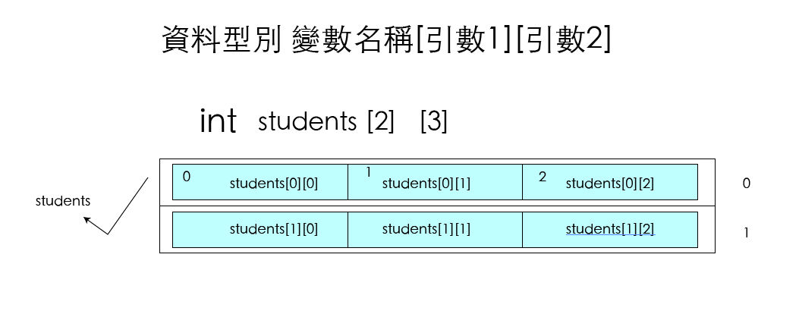
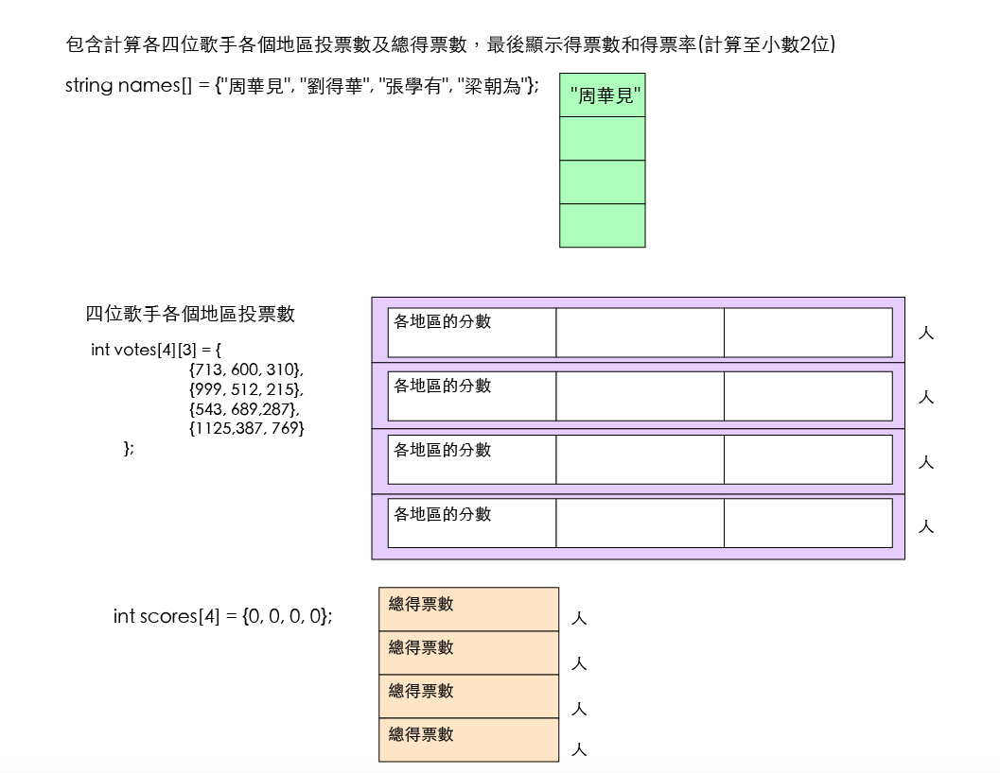

# 陣列 (Arrays)

## 一維陣列基礎

### 陣列宣告語法
```c
資料型別 陣列名稱[陣列長度];
```

### 陣列初值設定
```c
資料型別 陣列名稱[陣列長度 n];
陣列名稱[0] = 值1;
陣列名稱[1] = 值2;
// ...
```

### C/C++ 陣列特性
- 建立後就不可以改變大小
- 元素必須是相同的資料型別
- 必須要有建立一個陣列變數
- 每個元素有由 0 開始依順序的索引編號

### 陣列宣告範例
```c
int number[10];    // 宣告 10 個元素的整數陣列
double score[10];  // 宣告 10 個元素的浮點數陣列
char ascii[10];    // 宣告 10 個元素的字元陣列
```

### 範例 1：基本陣列操作 (array1.c)
```c
#include <stdio.h>

int main() {
    int scores[3];
    scores[0] = 70;
    scores[1] = 80;
    scores[2] = 90;
    printf("%d,%d,%d", scores[0], scores[1], scores[2]);
    return 0;
}
```
**輸出：** `70,80,90`

### 陣列初始化語法
```c
資料型別 陣列名稱[n] = {值1, 值2, 值3, ..., 值n};
```

### 範例 2：陣列初始化 (array2.c)
```c
#include <stdio.h>

int main() {
    int scores[3] = {70, 80, 90};
    printf("%d,%d,%d", scores[0], scores[1], scores[2]);
    return 0;
}
```
**輸出：** `70,80,90`

### 練習題：水果陣列 (fruit_s.c)
**題目：** 建立一個包含三個元素的字串陣列並設定初始值，代表個人的三種最喜愛的水果名稱，再依序顯示。

**預期輸出：**
```
我喜歡的第一種水果:xxx
我喜歡的第二種水果:xxx
我喜歡的第三種水果:xxx
```

**解答：**
```c
#include <stdio.h>

int main() {
    char fruits[3][10] = {"香蕉", "蘋果", "鳳梨"};
    int nums = 3;
    for(int i = 0; i < nums; i++) {
        printf("我喜歡的第%d種水果:%s\n", (i+1), fruits[i]);
    }
    return 0;
}
```

## 使用迴圈處理陣列

### 範例 3：學生成績統計 (score1.c)
建立一個包含五個元素的整數陣列，讓使用者輸入五位學生的成績，然後計算班級總成績及平均成績。

**預期輸出：**
```
請輸入第1位學生的成績: 78
請輸入第2位學生的成績: 89
請輸入第3位學生的成績: 67
請輸入第4位學生的成績: 90
請輸入第5位學生的成績: 89
全班總成績為: 413分, 平均為82.6分
```

**程式碼：**
```c
#include <stdio.h>

int main() {
    const int nums = 5;
    int scores[nums];
    int sum = 0;
    double ave;
    
    for(int i = 0; i < nums; i++) {
        printf("請輸入第%d位學生的成績: ", i+1);
        scanf("%d", &scores[i]);
    }

    for(int i = 0; i < nums; i++) {
        sum += scores[i];
    }

    ave = (double)sum / nums;

    printf("全班總成績為:%d分, 平均為%.1f分\n", sum, ave);
    return 0;
}
```

### 範例 4：C 語言版本成績統計 (score2.c)
使用 C 語言語法實現相同功能。

**預期輸出：**
```
請輸入第0位學生的成績: 78
請輸入第1位學生的成績: 90
請輸入第2位學生的成績: 79
請輸入第3位學生的成績: 89
請輸入第4位學生的成績: 94
全班總成績為: 430分, 平均為86.00分
```

**程式碼：**
```c
#include <stdio.h>
#include <stdlib.h>

int main(void) {
    const int nums = 5;
    int scores[nums];
    int sum = 0;
    double ave;
    
    for(int i = 0; i < nums; i++) {
        printf("請輸入第%d位學生的成績: ", i);
        scanf("%d", &scores[i]);
    }

    for(int i = 0; i < nums; i++) {
        sum += scores[i];
    }

    ave = (double)sum / nums;
    printf("全班總成績為:%d分, 平均為%.2f分\n", sum, ave);
    return EXIT_SUCCESS;
}
```

### 練習題：購物結帳系統 (sale_s.c)
**題目：** 小英是百貨公司結帳員，請您為她設計一個程式，先輸入客戶購買的貨品件數，再依此件數宣告陣列來儲存貨品價格，最後計算全部貨品總價。

**預期輸出：**
```
請輸入購買貨品件數: 4
請輸入第1件貨品的價格: xxx
請輸入第2件貨品的價格: xxx
請輸入第3件貨品的價格: xxx
請輸入第4件貨品的價格: xxx
全部貨品總價為: xxxxx元
```

**解答：**
```c
#include <stdio.h>

int main() {
    unsigned short num;
    unsigned long long int sum = 0;
    printf("請輸入購買貨品件數: ");
    scanf("%hu", &num);
    
    unsigned short nums_array[num];
    for(int i = 0; i < num; i++) {
        printf("請輸入第%d件貨品的價格: ", i+1);
        scanf("%hu", &nums_array[i]);
        sum += nums_array[i];
    }
    printf("全部貨品總價為:%llu元\n", sum);
    return 0;
}
```

### 練習題：尋找最小值 (min.c)
**題目：** 使用陣列配合 for 迴圈，找尋陣列中最小值的程式，程式執行時會要求輸入數值的數量，輸入完畢會顯示所輸入數值中的最小值。

**預期輸出：**
```
請輸入數值個數: 4
請輸入第1個數值: 4
請輸入第2個數值: 5
請輸入第3個數值: 6
請輸入第4個數值: 7
4 | 5 | 6 | 7 | 最小值是: 4
```

**解答：**
```c
#include <stdio.h>

int main() {
    unsigned int nums;
    unsigned int min;
    printf("請輸入數值個數: ");
    scanf("%u", &nums);
    
    unsigned int values[nums];
    for(int i = 0; i < nums; i++) {
        printf("請輸入第%d個數值: ", i+1);
        scanf("%u", &values[i]);
    }

    min = values[0];
    for(int i = 0; i < nums; i++) {
        if(values[i] < min) {
            min = values[i];
        }
        printf("%u | ", values[i]);
    }
    printf("最小值是: %u\n", min);
    return 0;
}
```


## 陣列大小計算

### 範例 5：計算陣列大小 (sizeof.c)
建立一個包含五個元素的整數陣列，使用 sizeof 計算陣列元素的個數，再使用 for 迴圈顯示陣列內容。

**預期輸出：**
```
陣列的大小為: 20, 一個元素的大小是4, 陣列的數量是5
```

**程式碼：**
```c
#include <stdio.h>

int main() {
    int n[] = {1, 3, 5, 7, 9};
    int totalSize = sizeof(n);
    int oneSize = sizeof(n[0]);
    int counts = totalSize / oneSize;
    
    printf("陣列的大小為:%d, 一個元素的大小是%d, 陣列的數量是%d\n", 
           totalSize, oneSize, counts);
    return 0;
}
```


## 陣列排序演算法

### 範例 6：泡沫排序 (bubble.c)
任由使用者輸入任意個數的數值序列，程式會將此數值序列由小到大排序後顯示。

**預期輸出：**
```
請輸入要排序的數值個數: 5
請輸入第1個數值: 45
請輸入第2個數值: 78
請輸入第3個數值: 24
請輸入第4個數值: 69
請輸入第5個數值: 91
排序前:
45 78 24 69 91
排序後:
24 45 69 78 91
```

**程式碼：**
```c
#include <stdio.h>

int main() {
    int nums;
    printf("請輸入要排序的數值個數: ");
    scanf("%d", &nums);
    float array[nums], temp;

    for(int i = 0; i < nums; i++) {
        printf("請輸入第%d個數值: ", i+1);
        scanf("%f", &array[i]);
    }

    printf("排序前:\n");
    for(int i = 0; i < nums; i++) {
        printf("%.0f ", array[i]);
    }

    // 泡沫排序演算法
    for(int i = 0; i < nums-1; i++) {
        for(int j = i+1; j < nums; j++) {
            if(array[i] > array[j]) {
                temp = array[i];
                array[i] = array[j];
                array[j] = temp;
            }
        }
    }

    printf("\n排序後:\n");
    for(int i = 0; i < nums; i++) {
        printf("%.0f ", array[i]);
    }
    printf("\n");
    return 0;
}
```

### 練習題：由大到小排序 (bubble_s.c)
**題目：** 實作由大到小的排序。

**預期輸出：**
```
排序前數值序列:
20 45 98 23 85
由大到小的排序後:
98 85 45 23 20
```

**解答：**
```c
#include <stdio.h>

int main() {
    int nums;
    printf("請輸入要排序的數值個數: ");
    scanf("%d", &nums);
    float array[nums], temp;

    for(int i = 0; i < nums; i++) {
        printf("請輸入第%d個數值: ", i+1);
        scanf("%f", &array[i]);
    }

    printf("排序前數值序列:\n");
    for(int i = 0; i < nums; i++) {
        printf("%.0f ", array[i]);
    }

    // 由大到小排序
    for(int i = 0; i < nums-1; i++) {
        for(int j = i+1; j < nums; j++) {
            if(array[i] < array[j]) {
                temp = array[i];
                array[i] = array[j];
                array[j] = temp;
            }
        }
    }

    printf("\n由大到小的排序後:\n");
    for(int i = 0; i < nums; i++) {
        printf("%.0f ", array[i]);
    }
    printf("\n");
    return 0;
}
```

## 陣列搜尋演算法

### 範例 7：循序搜尋 (sequential.c)
百貨公司舉辦週年抽獎活動，將顧客的抽獎編號及姓名分別儲存於陣列中，使用者輸入編號，程式會搜尋出該編號的姓名並顯示出來。若查詢不到也會顯示無此編號的訊息。

**預期輸出：**
```
請輸入中獎者的編號: 943
中獎者的姓名為: stu3 (共比對3次)
```

**程式碼：**
```c
#include <stdio.h>

int main() {
    int nums[] = {256, 731, 943, 389, 142, 645, 829, 945, 371, 418};
    char names[10][10] = {"stu1", "stu2", "stu3", "stu4", "stu5", 
                          "stu6", "stu7", "stu8", "stu9", "stu10"};
    int inputNum;
    int i;
    int n = sizeof(nums) / sizeof(nums[0]);
    int isfound = 0;
    
    printf("請輸入中獎者的編號: ");
    scanf("%d", &inputNum);
    
    for(i = 0; i < n; i++) {
        if(nums[i] == inputNum) {
            isfound = 1;
            break;
        }
    }

    if(isfound == 1) {
        printf("中獎者的姓名為:%s", names[i]);
    } else {
        printf("無此中獎號碼!");
    }

    printf(" (共比對%d次)\n", i+1);
    return 0;
}
```

### 範例 8：二分搜尋法 (binary.c)
使用二分搜尋法執行搜尋，效率比循序搜尋更高。

**預期輸出：**
```
排序後的編號:
142 256 371 389 418 645 731 829 943 945
請輸入中獎者的編號: 418
中獎者的姓名為: 林小10 (共比對1次)
```

**程式碼：**
```c
#include <stdio.h>

int main() {
    int num[] = {256, 731, 943, 389, 142, 645, 829, 945, 371, 418};
    char name[] = {"林小1", "林小2", "林小3", "林小4", "林小5", 
                     "林小6", "林小7", "林小8", "林小9", "林小10"};
    int n = sizeof(num) / sizeof(num[0]);
    int s, i, j, c, min, max, mid;
    int isFound;
    int tempInt;
    char tempstr;
    
    // 先排序陣列
    for(i = 0; i < n-1; i++) {
        for(j = i+1; j < n; j++) {
            if(num[i] > num[j]) {
                tempInt = num[i];
                num[i] = num[j];
                num[j] = tempInt;

                tempstr = name[i];
                name[i] = name[j];
                name[j] = tempstr;
            }
        }
    }

    printf("排序後的編號:\n");
    for(i = 0; i < n; i++) {
        printf("%d ", num[i]);
    }

    while(1) {
        isFound = 0;
        min = 0;
        max = n-1;
        c = 1;
        printf("\n請輸入中獎者的編號: ");
        scanf("%d", &s);
        
        while(min <= max) {
            mid = (min + max) / 2;
            if(num[mid] == s) {
                isFound = 1;
                break;
            }
            c++;
            if(num[mid] > s) {
                max = mid - 1;
            } else {
                min = mid + 1;
            }
        }

        if(isFound == 1) {
            printf("中獎者的姓名為:%s", name[mid]);
            printf(" (共比對%d次)\n", c);
            break;
        } else {
            printf("無此中獎號碼!");
            printf(" (共比對%d次)\n", c);
        }
    }
    return 0;
}
```

### 練習題：二分搜尋練習 (binary_s.c)
**題目：** 建立整數陣列 `int num[] = {67, 12, 9, 52, 91, 3}`，讓使用者輸入一個整數，以二分搜尋方法檢查該整數是否存在於陣列中，並顯示查詢結果。

## 字元陣列與字串

### 字串宣告方式
在 C 語言中，使用字串可以使用 char 陣列型別：

```c
char str[] = "DevC++";                    // 字元陣列
char str[] = {'D', 'e', 'v', 'C', '+', '+', '\0'};  // 字元陣列
char str[] = "DevC++";                    // 利用字串初始化字元陣列
```

### 範例 9：字串操作 (str1.c)

**預期輸出：**
```
str1: DevC++
str2: DevC++
str3: DevC++
str1: VirtualC++
```

**程式碼：**
```c
#include <stdio.h>
#include <string.h>

int main() {
    char str1[] = "DevC++";
    printf("str1: %s\n", str1);
    
    char str2[] = {'D', 'e', 'v', 'C', '+', '+', '\0'};
    printf("str2: %s\n", str2);
    
    char str3[] = "DevC++";
    printf("str3: %s\n", str3);

    strcpy(str1, "VirtualC++");
    printf("str1: %s\n", str1);

    // str2 = "VirtualC++"; // 錯誤：字元陣列不能重新賦值
    return 0;
}
```

**注意：** 在 C 語言中，字元陣列宣告後不能重新賦值，需要使用 strcpy 函數來複製字串。
 

## 多維陣列

### 二維陣列語法
```c
資料型別 變數名稱[列數][行數];
```

**範例：** 500個學生的學號及10科成績
```c
int score[500][10];  // 500列（學生）× 10行（科目）
```

### 二維陣列初值設定
```c
資料型別 陣列名稱[n1][n2];
陣列名稱[0][0] = 值1;
陣列名稱[0][1] = 值2;
// ...
陣列名稱[n1-1][n2-1] = 值n;
```

### 範例 10：二維陣列初始化 (initial2.c)
建立一個 2×3 的二維陣列並初始化，用來儲存 2 個學生各三科成績，再以 2 層巢狀迴圈將所有成績顯示出來。

**預期輸出：**
```
第1位學生第1科成績: 85
第1位學生第2科成績: 82
第1位學生第3科成績: 90
================================================
第2位學生第1科成績: 76
第2位學生第2科成績: 95
第2位學生第3科成績: 89
================================================
```

**程式碼：**
```c
#include <stdio.h>

int main() {
    int score[2][3] = {{85, 82, 90}, {76, 95, 89}};
    
    for(int i = 0; i < 2; i++) {
        for(int j = 0; j < 3; j++) {
            cout << "第" << i+1 << "位學生第" << j+1 << "科成績: " 
                 << score[i][j] << \n;
        }
        cout << "================================================" << \n;
    }
    return 0;
}
```


	
### 範例 11：隨機成績產生器
產生 50 個學生，每人 5 個科目的隨機成績（60-100分）。

**程式碼：**
```c
#include <stdio.h>
#include <time.h>

int randomScore() {
    return rand() % 41 + 60;  // 產生 60-100 的隨機分數
} 

int main() {
    srand(time(NULL));
    int students[50][5];
    
    for(int i = 0; i < 50; i++) {
        for(int j = 0; j < 5; j++) {
            students[i][j] = randomScore();
            cout << students[i][j] << " ";
        }
        cout << \n;
    }
    return 0;
}
```

### 範例 12：投票統計系統 (vote.c)
設計一個投票統計表，包含計算各四位歌手 3 個地區投票數及總得票數，最後顯示得票數和得票率。

**預期輸出：**
```
names[0]: 周華見
names[1]: 劉得華
names[2]: 張學有
names[3]: 梁朝為
周華見總票數為: 1623
周華見得票率為22.70%

劉得華總票數為: 1726
劉得華得票率為24.14%

張學有總票數為: 1519
張學有得票率為21.25%

梁朝為總票數為: 2281
梁朝為得票率為31.91%
```

**程式碼：**
```c
#include <stdio.h>
#include <stdio.h>

int main() {
    char names[] = {"周華見", "劉得華", "張學有", "梁朝為"};
    int namesCount = sizeof(names) / sizeof(names[0]);
    
    for(int i = 0; i < namesCount; i++) {
        cout << "names[" << i << "]: " << names[i] << \n;
    }

    int votes[4][3] = {
        {713, 600, 310},
        {999, 512, 215},
        {543, 689, 287},
        {1125, 387, 769}
    };

    int scores[4] = {0, 0, 0, 0};
    float totalScores = 0;
    
    for(int i = 0; i < namesCount; i++) {
        for(int j = 0; j < 3; j++) {
            scores[i] += votes[i][j];
        }
        totalScores += scores[i];
    }
    
    for(int i = 0; i < namesCount; i++) {
        printf("%s總票數為: %d\n", names[i], scores[i]);
        printf("%s得票率為%.2f%%\n\n", names[i], scores[i] / totalScores * 100);
    }

    return 0;
}
```


### 範例 13：大樂透選號程式 (biglottery.c)
撰寫一個大樂透電腦自動選號程式，程式執行會以亂數的方式顯示 1-49 之間七個不重複的大樂透號碼。

**預期輸出：**
```
本期大樂透電腦選號號碼如下:

2 28 8 42 49 20

特別號: 15
```

**程式碼：**
```c
#include <stdio.h>
#include <stdlib.h>
#include <time.h>

int main() {
    int num = 7;
    int lot[49];
    int choose[num];
    int maxIndex = 48;

    // 初始化號碼池 1-49
    for(int i = 0; i < 49; i++) {
        lot[i] = i + 1;
    }
    
    srand(time(NULL));
    
    // 隨機選取不重複號碼
    for(int i = 0; i < num; i++) {
        int randIndex = rand() % (maxIndex + 1);
        choose[i] = lot[randIndex];
        lot[randIndex] = lot[maxIndex];
        maxIndex--;
    }
    
    cout << "本期大樂透電腦選號號碼如下:" << \n << \n;
    
    for(int i = 0; i < num-1; i++) {
        cout << choose[i] << " ";
    }

    cout << \n << \n << "特別號: " << choose[num-1] << \n;
    return 0;
}
```

## 練習題

### 練習題：九九乘法表 (ninenine.c)
**題目：** 以程式建立 9×9 的二維整數陣列，陣列內容是九九乘法表的乘積，並將之輸出。

**預期輸出：**
```
1*1=1   1*2=2   1*3=3   1*4=4   1*5=5   1*6=6   1*7=7   1*8=8   1*9=9
2*1=2   2*2=4   2*3=6   2*4=8   2*5=10  2*6=12  2*7=14  2*8=16  2*9=18
3*1=3   3*2=6   3*3=9   3*4=12  3*5=15  3*6=18  3*7=21  3*8=24  3*9=27
4*1=4   4*2=8   4*3=12  4*4=16  4*5=20  4*6=24  4*7=28  4*8=32  4*9=36
5*1=5   5*2=10  5*3=15  5*4=20  5*5=25  5*6=30  5*7=35  5*8=40  5*9=45
6*1=6   6*2=12  6*3=18  6*4=24  6*5=30  6*6=36  6*7=42  6*8=48  6*9=54
7*1=7   7*2=14  7*3=21  7*4=28  7*5=35  7*6=42  7*7=49  7*8=56  7*9=63
8*1=8   8*2=16  8*3=24  8*4=32  8*5=40  8*6=48  8*7=56  8*8=64  8*9=72
9*1=9   9*2=18  9*3=27  9*4=36  9*5=45  9*6=54  9*7=63  9*8=72  9*9=81
```

**解答：**
```c
#include <stdio.h>

int main() {
    unsigned short elements[9][9];
    
    // 計算九九乘法表
    for(int i = 0; i < 9; i++) {
        for(int j = 0; j < 9; j++) {
            elements[i][j] = (i+1) * (j+1);
        }
    }

    // 輸出九九乘法表
    for(int i = 0; i < 9; i++) {
        for(int j = 0; j < 9; j++) {
            cout << i+1 << "*" << j+1 << "=" << elements[i][j] << "\t";
        }
        cout << \n;
    }
    return 0;
}
```

### 練習題：十個數字排序 (sorted.c)
**題目：** 建立一個長度為 10 的一維整數陣列，可以供使用者輸入 10 個數字後，並由小到大排序輸出。

**解答：**
```c
#include <stdio.h>

int main() {
    const int nums = 10;
    float array[nums], temp;
    
    cout << "請輸入10個要排序的數字" << \n;

    for(int i = 0; i < nums; i++) {
        cout << "請輸入第" << i+1 << "個數值: ";
        cin >> array[i];
    }

    cout << "排序前:" << \n;
    for(int i = 0; i < nums; i++) {
        cout << array[i] << " ";
    }

    // 陣列排序（由小到大）
    for(int i = 0; i < nums-1; i++) {
        for(int j = i+1; j < nums; j++) {
            if(array[i] > array[j]) {
                temp = array[i];
                array[i] = array[j];
                array[j] = temp;
            }
        }
    }

    cout << \n << "排序後:" << \n;
    for(int i = 0; i < nums; i++) {
        cout << array[i] << " ";
    }
    cout << \n;
    return 0;
}
```

### 練習題：年齡排序系統 (ageSorted.c)
**題目：** 建立一個姓名陣列及一個同樣長度的年齡陣列，使用者可以依選項選擇將年齡由小到大，或由大到小排序，並搭配姓名輸出。

**預設資料：**
```c
char names[] = {"老李", "王種", "發叔", "龍哥", "小陳", "小張"};
int ages[] = {56, 45, 51, 48, 35, 57};
```

**預期輸出：**
```
尚未排序前:
老李    王種    發叔    龍哥    小陳    小張
56      45      51      48      35      57

1.由小到大排序      2.由大到小排序
請輸入選項: 1

由小到大排序後:
小陳    王種    龍哥    發叔    老李    小張
35      45      48      51      56      57
```

**解答：**
```c
#include <stdio.h>

int main() {
    int inputValue = 0;
    int nums;
    int temp1;
    char temp2;
    char names[] = {"老李", "王種", "發叔", "龍哥", "小陳", "小張"};
    int ages[] = {56, 45, 51, 48, 35, 57};
    nums = sizeof(ages) / sizeof(ages[0]);

    cout << "尚未排序前:" << \n;
    for(int i = 0; i < nums; i++) {
        cout << names[i] << "\t";
    }
    cout << \n;
    for(int i = 0; i < nums; i++) {
        cout << ages[i] << "\t";
    }
    cout << \n << \n;

    cout << "1.由小到大排序\t\t2.由大到小排序" << \n;
    cout << "請輸入選項: ";
    cin >> inputValue;

    switch(inputValue) {
        case 1:
            // 由小到大排序
            for(int i = 0; i < nums-1; i++) {
                for(int j = i+1; j < nums; j++) {
                    if(ages[i] > ages[j]) {
                        temp1 = ages[i];
                        ages[i] = ages[j];
                        ages[j] = temp1;

                        temp2 = names[i];
                        names[i] = names[j];
                        names[j] = temp2;
                    }
                }
            }
            cout << "\n由小到大排序後:" << \n;
            break;

        case 2:
            // 由大到小排序
            for(int i = 0; i < nums-1; i++) {
                for(int j = i+1; j < nums; j++) {
                    if(ages[i] < ages[j]) {
                        temp1 = ages[i];
                        ages[i] = ages[j];
                        ages[j] = temp1;

                        temp2 = names[i];
                        names[i] = names[j];
                        names[j] = temp2;
                    }
                }
            }
            cout << "\n由大到小排序後:" << \n;
            break;
    }

    for(int i = 0; i < nums; i++) {
        cout << names[i] << "\t";
    }
    cout << \n;
    for(int i = 0; i < nums; i++) {
        cout << ages[i] << "\t";
    }
    cout << \n;

    return 0;
}
```
