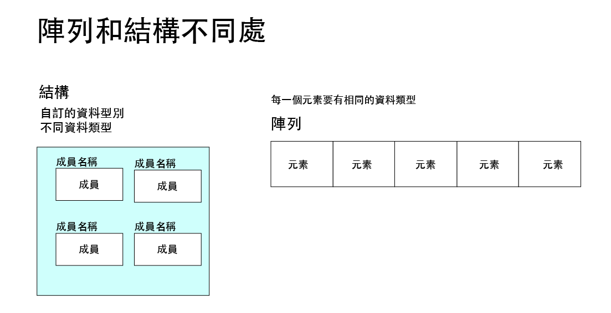

# C++ 結構 (Struct)



## 目錄 (Table of Contents)

### 基礎概念
- [結構基本語法](#結構基本語法)
  - [定義結構](#定義結構)
  - [建立結構變數](#建立結構變數)

### 基礎範例
- [範例1：矩形面積計算器](#範例1矩形面積計算器-rectangle-area-calculator)
- [範例2：座標點系統](#範例2座標點系統-point-coordinate-system)

### 進階概念
- [範例3：巢狀結構](#範例3巢狀結構-nested-structure)

### 結構成員存取
- [使用「.」運算子存取結構成員](#使用運算子存取結構成員)
- [範例4：學生成績系統](#範例4學生成績系統-student-grade-system)
- [範例5：學生陣列系統](#範例5學生陣列系統-student-array-system)
- [範例6：多科目成績統計](#範例6多科目成績統計-multi-subject-grade-statistics)

### 結構指標操作
- [範例7：BMI計算器](#範例7bmi計算器-bmi-calculator)

### 綜合應用
- [範例8：學生成績管理系統](#範例8學生成績管理系統-student-grade-management-system)
  - [主程式 (main.cpp)](#主程式-maincpp)
  - [標頭檔 (data.h)](#標頭檔-datah)
  - [實作檔 (data.cpp)](#實作檔-datacpp)

### 總結
- [重點整理](#重點整理)

---

## 結構基本語法

### 定義結構
```c++
struct 結構名稱 {
    資料型別 成員變數1;
    資料型別 成員變數2;
    資料型別 成員變數3;
};
```

### 建立結構變數
```c++
結構名稱 結構變數;
```

## 基礎範例

### 範例1：矩形面積計算器 (Rectangle Area Calculator)


宣告Rectangle結構，並建立結構變數Height,Width表示長和寬，輸入矩形的長和寬後計算面積

```c++
// Rectangle1.cpp - 矩形面積計算器
#include <iostream>
using namespace std;

struct Rectangle {
    int width;
    int height;
};

int main() {
    struct Rectangle rec = {0, 0};
    cout << "請輸入width: ";
    cin >> rec.width;
    cout << "請輸入height: ";
    cin >> rec.height;
    
    cout << "矩形的面積是: " << rec.width * rec.height << endl;
    return 0;
}
```

### 範例2：座標點系統 (Point Coordinate System)

使用typedef重新定義資料類型的名稱

```c++
// Point.cpp - 座標點系統
#include <iostream>
using namespace std;

// 定義結構point，成員有x和y
// typedef 重新定義資料類型的名稱
typedef struct point {
    float x;
    float y;
} Point;

int main() { 
    Point p1;
    p1.x = 4.5;
    p1.y = 6.5;

    Point p2;
    p2.x = 8.3;
    p2.y = 9.6;

    cout << "點1座標: (" << p1.x << ", " << p1.y << ")" << endl;
    cout << "點2座標: (" << p2.x << ", " << p2.y << ")" << endl;
    
    return 0;
}
```

## 進階概念

### 範例3：巢狀結構 (Nested Structure)

巢狀結構允許在一個結構中包含另一個結構作為成員

```c++
// NestedStruct.cpp - 巢狀結構範例
#include <iostream>
using namespace std;

// 定義點結構
typedef struct point {
    float x;
    float y;
} Point;

// 定義尺寸結構
typedef struct size {
    float width;
    float height;
} Size;

// 巢狀結構 - 矩形包含點和尺寸
typedef struct rect {
    Point p;    // 起始點
    Size s;     // 尺寸
} Rect;

int main() { 
    Rect r1;
    r1.p = {4.5, 5.6};
    r1.s = {21.5, 18.9};

    cout << "矩形資訊:" << endl;
    cout << "起始點 x座標: " << r1.p.x << endl;
    cout << "起始點 y座標: " << r1.p.y << endl;
    cout << "寬度: " << r1.s.width << endl;
    cout << "高度: " << r1.s.height << endl;
    
    return 0;
}
```


## 結構成員存取

### 使用「.」運算子存取結構成員

```c++
struct Student david = {99001, "robert", 75, 86, 90};
david.name      // 存取姓名
david.chinese   // 存取國文成績
david.math      // 存取數學成績
david.english   // 存取英文成績
```

### 範例4：學生成績系統 (Student Grade System)

```c++
// StudentGrade.cpp - 學生成績系統
#include <iostream>
using namespace std;

// 宣告(定義)結構
struct Student {
    char name[8];
    int score;
};

int main() {
    // 建立結構實體
    struct Student david = {"David", 90};
    
    cout << "姓名\t成績" << endl;
    cout << david.name << "\t" << david.score << endl;
    
    return 0;
}
```

### 範例5：學生陣列系統 (Student Array System)

使用結構陣列管理多個學生資料

```c++
// StudentArray.cpp - 學生陣列系統
#include <iostream>
using namespace std;

typedef struct Student {
    string name;
    int score;
} Student;

int main() {
    Student stus[3] = {
        {"robert", 94},
        {"david", 91}, 
        {"alice", 94}
    };

    int stuCount = sizeof(stus) / sizeof(stus[0]);
    
    cout << "學生成績列表:" << endl;
    for(int i = 0; i < stuCount; i++) {
        cout << "第" << i+1 << "位學生是 " << stus[i].name 
             << "，分數是 " << stus[i].score << endl;
    }
    
    return 0;
}
```

### 範例6：多科目成績統計 (Multi-Subject Grade Statistics)

結構中包含陣列，計算學生多科目總分

```c++
// MultiSubjectGrades.cpp - 多科目成績統計
#include <iostream>
using namespace std;

typedef struct Student {
    string name;
    int scores[5];  // 五個科目的成績
} Student;

int main() {
    Student stus[3] = {
        {"robert", {78, 98, 78, 63, 83}},
        {"david", {78, 98, 58, 73, 73}}, 
        {"alice", {68, 98, 74, 63, 82}}
    };

    int stuCount = sizeof(stus) / sizeof(stus[0]);
    
    cout << "學生總分統計:" << endl;
    for(int i = 0; i < stuCount; i++) {
        int sum = 0;
        for(int j = 0; j < 5; j++) {
            sum += stus[i].scores[j];
        }
        cout << "第" << i+1 << "位學生是 " << stus[i].name 
             << "，總分數是 " << sum << endl;
    }
    
    return 0;
}
```

## 結構指標操作

### 範例7：BMI計算器 (BMI Calculator)

使用指標變數操控結構，透過「->」運算子存取結構成員

```c++
// BMICalculator.cpp - BMI計算器
#include <cmath>
#include <iostream>
using namespace std;

typedef struct bmi {
    string name;
    int height;
    int weight;
} BMI;

int main() {
    int nums;
    cout << "========BMI計算==========" << endl;
    cout << "請輸入要計算的人數: ";
    cin >> nums;
    
    BMI bmis[nums];
    
    // 輸入資料
    for (int i = 0; i < nums; i++) {
        BMI* one = &bmis[i];
        cout << "請輸入第" << i+1 << "位的姓名,身高,體重(中間要空隔): ";
        cin >> one->name >> one->height >> one->weight;    
    }

    // 計算並顯示BMI
    cout << "\n========計算結果==========" << endl;
    for (int i = 0; i < nums; i++) {
        BMI *one = &bmis[i];
        double bmi = one->weight / pow(one->height / 100.0, 2);
        cout << one->name << endl;
        printf("您的BMI是: %.2f\n\n", bmi);
    }
    
    return 0;
}
```

**執行結果範例:**
```
========BMI計算==========
請輸入要計算的人數: 3
請輸入第1位的姓名,身高,體重(中間要空隔): robert 170 70
請輸入第2位的姓名,身高,體重(中間要空隔): jenny 160 70
請輸入第3位的姓名,身高,體重(中間要空隔): david 183 77

========計算結果==========
robert
您的BMI是: 24.22

jenny
您的BMI是: 27.34

david
您的BMI是: 22.99
```

## 綜合應用

### 範例8：學生成績管理系統 (Student Grade Management System)

建立50個學生，計算平均和總分並進行排名。此範例展示模組化程式設計。

#### 主程式 (main.cpp)
```c++
// StudentManagement.cpp - 學生成績管理系統主程式
#include <iostream>
#include "data.h"
#include <stdlib.h>
#include <time.h>

using namespace std;

int main() {
    srand(time(NULL));
    int studentCount = 50;
    Student students[studentCount];
    
    // 建立學生資料
    for(int i = 0; i < studentCount; i++) {
        students[i] = createStudent(i + 1);
    }
    
    // 依總分排序
    sortStudent(students, studentCount);
    
    // 顯示結果
    cout << "姓名\t國文\t英文\t數學\t總分\t平均\t名次" << endl;
    cout << "================================================" << endl;
    
    for(int i = 0; i < studentCount; i++) {
        Student s = students[i];
        cout << s.name << "\t" << s.chinese << "\t" << s.english 
             << "\t" << s.math << "\t" << sum(s) << "\t";
        printf("%.2f\t%d\n", average(s), i + 1);
    }
    
    return 0;
}
```

#### 標頭檔 (data.h)
```c++
// data.h - 學生資料結構與函式宣告
#ifndef DATA_H
#define DATA_H

#include <iostream>
#include <stdlib.h>
using namespace std;

typedef struct student {
    string name;
    int chinese;
    int english;
    int math;
} Student;

// 函式宣告
Student createStudent(int num);     // 建立一個學生
int sum(Student s);                 // 計算學生總分
float average(Student s);           // 計算學生平均
void sortStudent(Student* s, int nums);  // 排序

#endif
```

#### 實作檔 (data.cpp)
```c++
// data.cpp - 學生資料處理函式實作
#include "data.h"

Student createStudent(int num) {
    Student s;
    s.name = "學生" + to_string(num);
    s.chinese = 50 + (rand() % 51);  // 50-100分
    s.english = 50 + (rand() % 51);  // 50-100分
    s.math = 50 + (rand() % 51);     // 50-100分
    return s;
}

int sum(Student s) {
    return s.chinese + s.english + s.math;
}

float average(Student s) {
    return sum(s) / 3.0;
}

void sortStudent(Student s[], int nums) {
    Student temp;
    // 氣泡排序法 - 依總分由高到低排序
    for(int i = 0; i < nums - 1; i++) {
        for(int j = i + 1; j < nums; j++) {
            if (sum(s[i]) < sum(s[j])) {
                temp = s[i];
                s[i] = s[j];
                s[j] = temp;
            }
        }
    }
}
```

## 重點整理

1. **結構定義**: 使用 `struct` 關鍵字定義自訂資料型別
2. **成員存取**: 使用 `.` 運算子存取結構成員
3. **指標存取**: 使用 `->` 運算子透過指標存取結構成員
4. **typedef**: 重新定義資料型別名稱，簡化程式碼
5. **巢狀結構**: 結構中可包含其他結構作為成員
6. **結構陣列**: 可建立結構的陣列來管理多筆資料
7. **模組化設計**: 將相關功能分離到不同檔案中，提高程式可維護性

